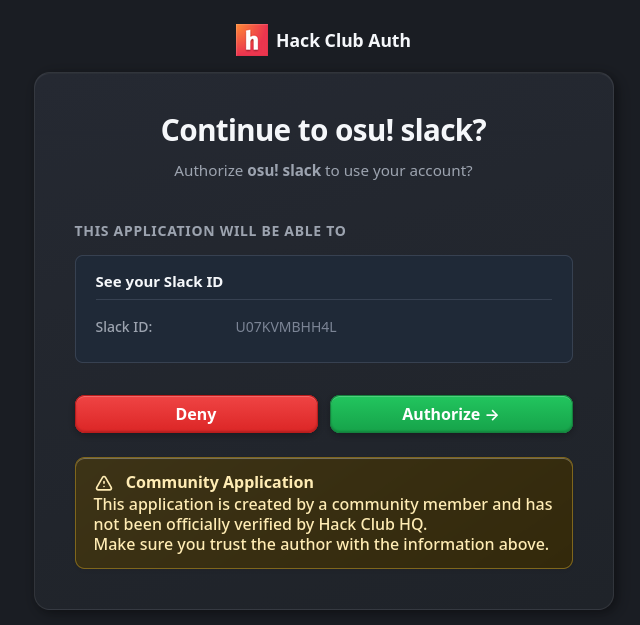
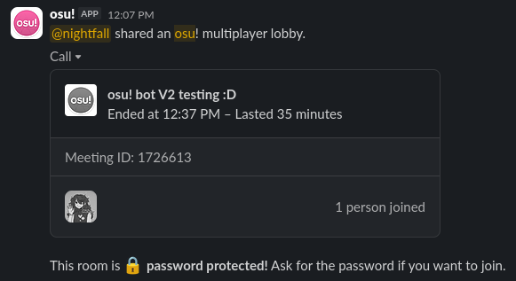

# osu! bot V2
A rewrite of [osu! bot](https://github.com/DaInfLoop/osu-leaderboard) for the Hack Club slack.

## Features
### 1. Hack Club Account Linking
osu! bot V2 uses [Identity Vault](https://identity.hackclub.com) to link your Slack ID to your osu! account. The entire linking process takes place within your browser, compared to osu! bot V1 where the auth process split between Slack and the browser.



### 2. Multiplayer lobbies
osu! bot V2 allows you to invite players to your multiplayer lobbies much more nicely than osu! bot V1, opting to use Slack's Calling API rather than buttons.

> [!CAUTION]  
> This feature is very buggy (mostly because I've never used the Calls API, and also this isn't being used for calling :p).  
> At any time, this feature might change, or be removed entirely.



## Setup
A lot of things in this is built _specifically_ for the Hack Club Slack. Mostly because Hack Club accounts are being used. However, you can manually link accounts by inserting into the Postgres database.

### Postgres tables
```sql
CREATE TABLE users (
    slack_id    varchar(255),
    osu_id      varchar(255)
);

CREATE TABLE multi_lobby (
    lobby_id        int,
    slack_call_id   varchar(255)
);
```

### Environmental variables
```ini
NODE_ENV=development
PORT=3000

#####################
# SLACK CREDENTIALS #
#####################

BOT_TOKEN="xoxb-...."
SIGNING_SECRET="..."

###########################################################
# NGROK CREDENTIALS                                       #
# [ngrok will only be used if NODE_ENV is "development".] #
###########################################################

NGROK_TOKEN="" # or NONE, to disable this altogether
NGROK_DOMAIN=""

########################
# POSTGRES CREDENTIALS #
########################

PG_HOST=""
PG_USER=""
PG_DATABASE=""
PG_PASSWORD=""

##########################
# OSU OAUTH2 CREDENTIALS #
##########################

OSU_CLIENT_ID=""
OSU_CLIENT_SECRET=""

#####################################
# IDENTITY VAULT OAUTH2 CREDENTIALS #
#####################################

IDV_CLIENT_ID=""
IDV_CLIENT_SECRET=""
```

### Hardcoded values
The linking URL for production (+ development if `NGROK_DOMAIN` is not set) is hardcoded to `https://osu.rana.hackclub.app/link`, as this is where osu! bot V2 will run usually. You won't usually need to change this during development (except if you don't want to use ngrok).

The URL can be found (and edited) in [`src/commands/osu-multiplayer.ts`](src/commands/osu-multiplayer.ts).

However, it is much easier to use ngrok during development to avoid having to change the URL back afterwards.

## License
This repository is licensed under the MIT License. A copy of the license can be viewed at [LICENSE](/LICENSE).